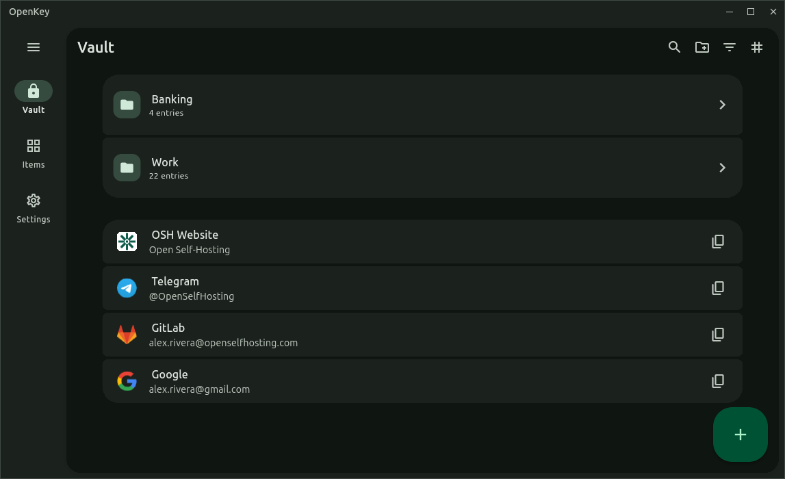
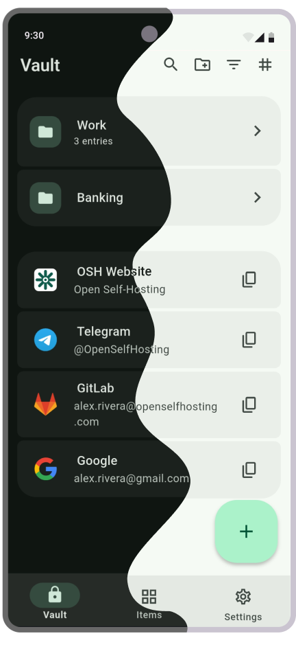
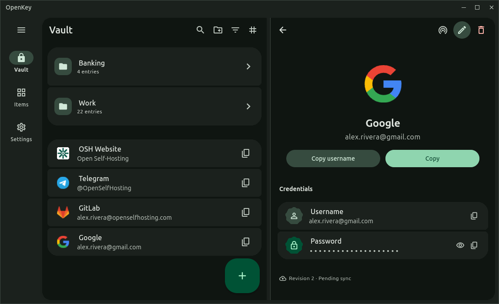
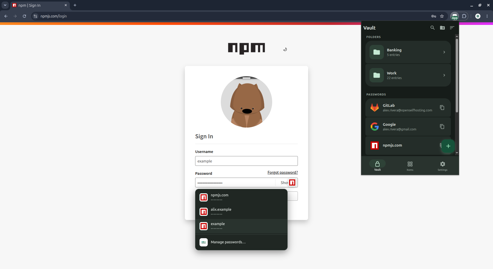
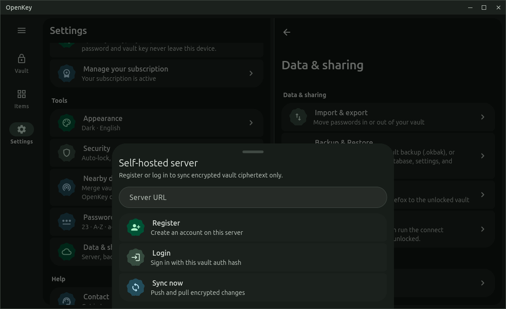
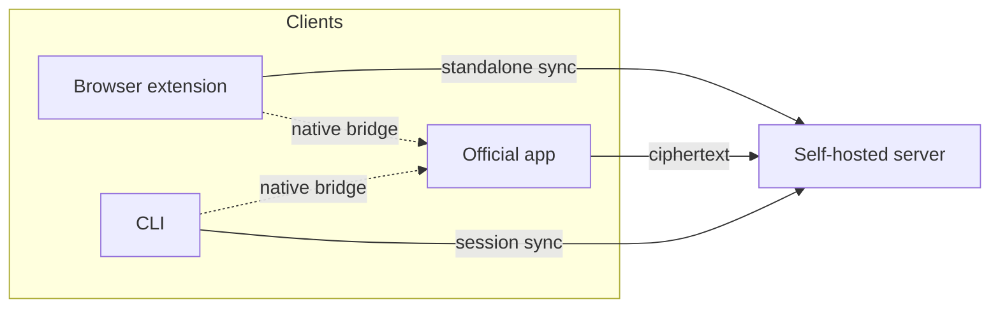

<p align="center">
  
</p>

<h1 align="center">OpenKey</h1>

<p align="center">
  <strong>Self-hosted, zero-knowledge password manager</strong><br>
  Encrypt on the device. Sync ciphertext only. You keep the keys.
</p>

<p align="center">
  <a href="https://github.com/OpenSelfHosting"></a>
  <a href="./LICENSE"></a>
  <a href="./spec/"></a>
  <a href="./spec/crypto.md"></a>
  <a href="./SECURITY.md"></a>
</p>

<p align="center">
  <a href="https://openkey.openselfhosting.com">Website</a>
  ·
  <a href="https://openkey.openselfhosting.com/guide/download">Download</a>
  ·
  <a href="./spec/">Protocol spec</a>
  ·
  <a href="https://openkey.openselfhosting.com/guide/security">Security model</a>
  ·
  <a href="https://openkey.openselfhosting.com/ar/">Arabic</a>
</p>

<p align="center">
  Android · iOS · macOS · Linux · Windows
</p>

<table>
  <tr>
    <td width="50%" valign="bottom" align="center">
      
    </td>
    <td width="50%" valign="bottom" align="center">
      
    </td>
  </tr>
  <tr>
    <td align="center"><sub>Desktop — macOS, Windows, Linux</sub></td>
    <td align="center"><sub>Mobile — Android, iOS</sub></td>
  </tr>
</table>

OpenKey is a password manager built so the optional sync server **cannot read your vault**. Clients encrypt collection names, logins, cards, crypto wallets, secrets, and attachments on the device. The server stores opaque ciphertext, KDF parameters, and a wrapped vault key — never the master password.

The **protocol is open**. The official app is not. Audit the cryptography and self-host from this repository and the MIT-licensed packages. Install the official client from [GitHub Releases](https://github.com/OpenSelfHosting/OpenKey/releases) or the [download page](https://openkey.openselfhosting.com/guide/download).

---

## Features

<table>
  <tr>
    <td width="33%" valign="top" align="center">
      <br>
      <strong>Zero-knowledge</strong><br>
      <sub>Argon2id on the client. AES-256-GCM for vault payloads. The master password never leaves the device.</sub>
    </td>
    <td width="33%" valign="top" align="center">
      <br>
      <strong>Self-hosted sync</strong><br>
      <sub>Optional FastAPI + PostgreSQL API you run. Personal vaults work fully offline.</sub>
    </td>
    <td width="33%" valign="top" align="center">
      <br>
      <strong>Every major platform</strong><br>
      <sub>Official app on Android, iOS, macOS, Linux, and Windows. Nearby LAN sync on Pro.</sub>
    </td>
  </tr>
  <tr>
    <td width="33%" valign="top" align="center">
      <br>
      <strong>Autofill &amp; passkeys</strong><br>
      <sub>System credential provider plus an MV3 extension for Chrome, Edge, Firefox, and other Chromium browsers.</sub>
    </td>
    <td width="33%" valign="top" align="center">
      <br>
      <strong>Open clients</strong><br>
      <sub>Browser extension and CLI implement the same protocol. Independent implementations are welcome.</sub>
    </td>
    <td width="33%" valign="top" align="center">
      <br>
      <strong>Audit the math</strong><br>
      <sub>KDF, vault format, and sync contract are public. Report issues privately — see Security.</sub>
    </td>
  </tr>
</table>

The vault holds logins (with TOTP), payment cards, crypto wallets, developer secrets, nested collections, and encrypted attachments. **OpenKey Pro** removes free-tier caps (50 logins, 3 folders / cards / wallets / secrets) and unlocks export, `.okbak` backups, Nearby, organizations, sharing, and attachments. Details: [Pricing](https://openkey.openselfhosting.com/pricing).

---

## Product screenshots

<table>
  <tr>
    <td width="50%" valign="top">
      
      <p align="center"><sub><strong>Vault</strong> — collections, search, and item types</sub></p>
    </td>
    <td width="50%" valign="top">
      
      <p align="center"><sub><strong>Entry</strong> — password, TOTP, passkey, or card</sub></p>
    </td>
  </tr>
  <tr>
    <td width="50%" valign="top">
      
      <p align="center"><sub><strong>Autofill</strong> — system provider or browser extension</sub></p>
    </td>
    <td width="50%" valign="top">
      
      <p align="center"><sub><strong>Sync</strong> — Settings → Data → Self-hosted server</sub></p>
    </td>
  </tr>
</table>

Capture notes: [`docs/screenshots/README.md`](./docs/screenshots/README.md).

---

## What you can open and audit

| Piece | Repository | License |
|-------|------------|---------|
| Protocol spec (KDF, vault payload, sync) | [`spec/`](./spec/) in this repo | MIT |
| Sync server | [OpenKey_server](https://github.com/OpenSelfHosting/OpenKey_server) | MIT |
| Browser extension | [OpenKey_extension](https://github.com/OpenSelfHosting/OpenKey_extension) | MIT |
| Developer CLI | [OpenKey_cli](https://github.com/OpenSelfHosting/OpenKey_cli) | MIT |
| Documentation site | [OpenKey_docs](https://github.com/OpenSelfHosting/OpenKey_docs) | MIT |

Product site: [openkey.openselfhosting.com](https://openkey.openselfhosting.com). Company: [openselfhosting.com](https://openselfhosting.com).

The official **OpenKey app** (Android, iOS, macOS, Linux, Windows) is proprietary. Source is not published. Binaries for that client are attached to **this** repository’s GitHub Releases. Use of the app is under the [Terms of Service](https://openkey.openselfhosting.com/terms). [Privacy Policy](https://openkey.openselfhosting.com/privacy). Subscriptions (**OpenKey Pro**) are sold through the app stores (RevenueCat).



Nearby LAN sync (Pro) is peer-to-peer on the local network. It does **not** go through the API.

---

## Download the app

| Channel | What you get |
|---------|----------------|
| **[GitHub Releases](https://github.com/OpenSelfHosting/OpenKey/releases)** | Linux (AppImage, `.deb`, `.rpm`, `.tar.gz`), Android APK/AAB, and desktop installers as they are published |
| **Stores** | Google Play, App Store, Mac App Store, Microsoft Store, Flathub, Snap — see [Download](https://openkey.openselfhosting.com/guide/download) |

Application id: `com.openselfhosting.openkey`. Do not expect a public `flutter build` of the official client.

---

## Self-host the sync server

The server is optional. Personal vaults work offline. Sync across your devices needs an instance you control.

```bash
git clone https://github.com/OpenSelfHosting/OpenKey_server.git
cd OpenKey_server
cp .env.example .env
openssl rand -hex 32   # paste into JWT_SECRET in .env
docker compose up --build -d
```

API: `http://localhost:8000` · OpenAPI: `/docs` · Health: `/health`

Then in the official app: **Settings → Data → Self-hosted server** → that URL → register or log in → sync.

Production: HTTPS in front of the API, unique `JWT_SECRET` (min 32 characters), explicit `CORS_ORIGINS` (never `*`). Full guide: [Install the server](https://openkey.openselfhosting.com/guide/server).

---

## How encryption works

1. `Argon2id(utf8(trim(email).toLowerCase() + ":" + master_password), salt)` → master key
2. Master key → `auth_hash` (HMAC-SHA256 with `"openkey-auth"`, sent to the server) and wraps the vault key
3. Vault key encrypts collection names and entry payloads (**AES-256-GCM**)
4. The server stores salt, KDF params, wrapped vault key, and opaque ciphertext — not the master password

There is no master-password recovery. If it is lost, ciphertext is unrecoverable.

Details: [`spec/crypto.md`](./spec/crypto.md) · [Security](https://openkey.openselfhosting.com/guide/security)

---

## Browser extension and CLI

Open source. They speak the same protocol as the official app (standalone vault + optional native bridge to the **unlocked** desktop or Android app).

```bash
# Extension (Chrome / Edge / Firefox)
git clone https://github.com/OpenSelfHosting/OpenKey_extension.git
cd OpenKey_extension && npm install && npm run build
# load dist/ unpacked in chrome://extensions or about:debugging

# CLI — Node.js 20+
npm install -g openkey-cli
```

Vault CLI commands need the official app unlocked (native bridge, including Termux on Android) **or** `openkey login` / `unlock` against your server.

Guides: [Extension](https://openkey.openselfhosting.com/guide/extension) · [CLI](https://openkey.openselfhosting.com/guide/cli)

---

## Security

Report vulnerabilities **privately** to **security@openselfhosting.com** — do not open a public issue for exploitable bugs. See [SECURITY.md](./SECURITY.md).

---

## License

Documentation and spec in this repository: [MIT](./LICENSE). Official app source: proprietary (separate repository).
